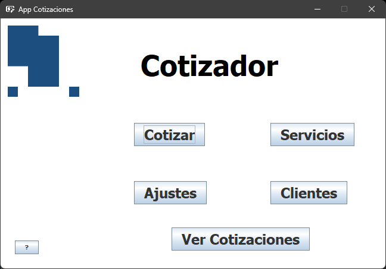
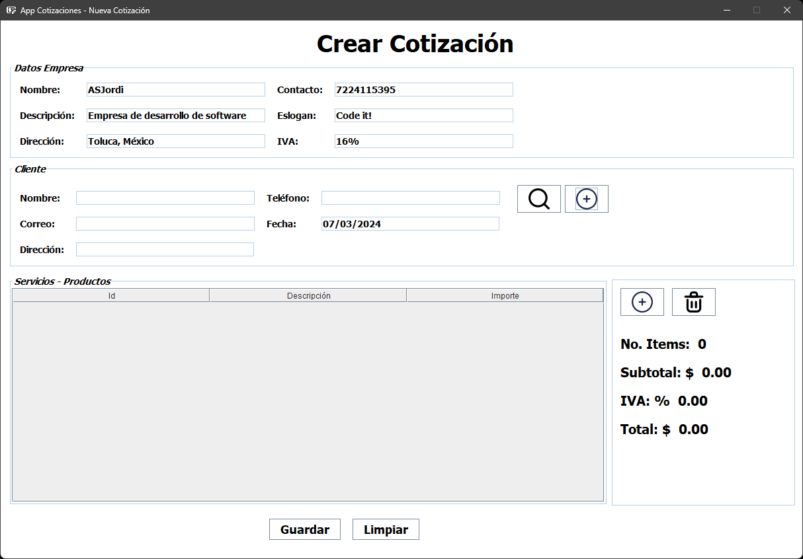
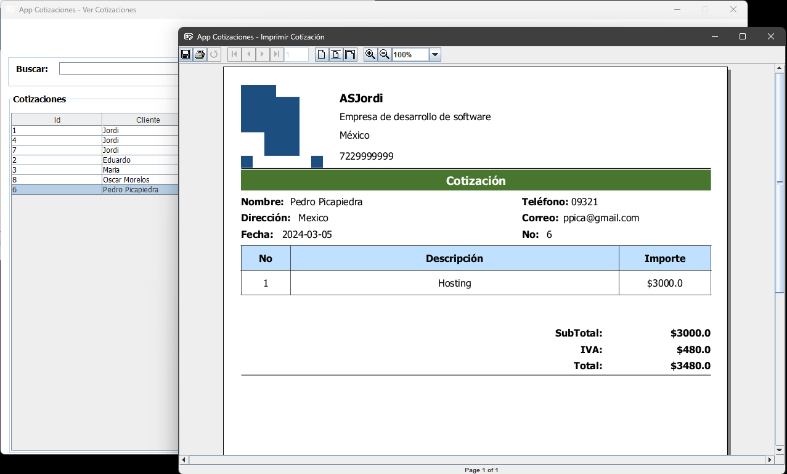

<div align="center">
  <h1 align="center"><a href="https://github.com/ASJordi/app-cotizaciones-java">App Cotizaciones</a></h1>

  <p align="center">Aplicación de escritorio en Java para la creación de cotizaciones</p>
</div>

## Acerca de :computer:

App Cotizaciones es una aplicación de escritorio desarrollada en Java y MySQL para la creación de cotizaciones. Permite configurar datos de la empresa, clientes, productos y servicios, y generar cotizaciones en formato PDF.





## Stack :hammer_and_wrench:

* Java SE
* Java Swing
* JDBC
* MySQL
* JasperReports

## Instalación :gear:

- Clonar el repositorio
```sh
git@github.com:ASJordi/app-cotizaciones-java.git
```

- Crea la base de datos con el archivo `src/main/resources/db/database.sql`
- Abrir el proyecto con NetBeans
- Descargar las dependencias de Maven
- Configurar la conexión a la base de datos en `src/main/java/dev/asjordi/cotizador/utils/ConnectionDatabase.java`
- Ejecutar el proyecto

## Licencia :page_facing_up:

Distribuido bajo la licencia MIT. Consulte `LICENSE` para obtener más información.

## Contacto :email:

Jordi Ayala - [@ASJordi](https://twitter.com/ASJordi)

Project Link: [https://github.com/ASJordi/app-cotizaciones-java](https://github.com/ASJordi/app-cotizaciones-java)
